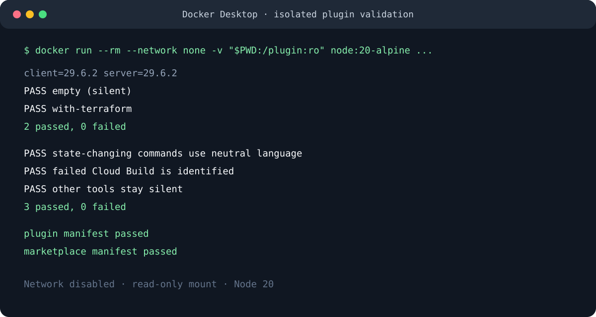
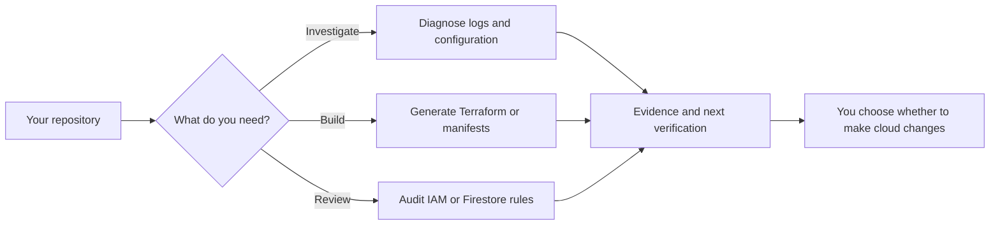

# GCP DevKit for Claude Code

GCP DevKit gives Claude Code a practical Google Cloud playbook for the moments that matter: a Cloud Run service is failing, IAM is too broad, Terraform needs to be safe by default, or a GKE workload needs a clean path to production.

It does not deploy into your account on its own. Instead, it helps you inspect, diagnose, generate, and verify with clear next steps that stay under your control.



## Why install it

- Get an incident-ready path for Cloud Run, GKE, Cloud Functions, Pub/Sub, and IAM failures.
- Generate conservative Terraform with variables, labels, private defaults, and least-privilege IAM guidance.
- Review IAM bindings and user-managed service account keys before a handoff or release.
- Create safer Cloud Run, GKE, and Firestore starting points without having to remember every platform-specific detail.
- Keep GCP context relevant: lightweight local hooks recognize Terraform, Cloud Run, App Engine, and Firestore artifacts in the project you opened.



## What it helps with

| Situation | Ask Claude Code |
| --- | --- |
| A Cloud Run revision is returning errors | `/gcp-devkit:gcloud-debug api in us-central1` |
| You need a predictable Cloud Run deployment package | `/gcp-devkit:cloud-run-deploy node api in us-central1` |
| You want to see who has risky IAM access | `/gcp-devkit:iam-audit my-project-id` |
| You are starting a new GCP Terraform module | `/gcp-devkit:terraform-gcp Cloud Run API with Cloud SQL` |
| A GKE workload needs Workload Identity and HTTPS | `/gcp-devkit:gke-manifest API behind a managed certificate` |
| You need a Firestore rules review | `/gcp-devkit:firestore-rules audit firestore.rules` |
| You want a quick environment and project check | `/gcp-devkit:doctor` then `/gcp-devkit:project` |

For a multi-step move from AWS or Azure, explicitly ask Claude to use the `gcp-devkit:migration-planner` agent. It will plan phases and tradeoffs; it does not make cloud changes.

## Install

GCP DevKit is a **Claude Code plugin**. It is not a Claude.ai chat attachment or an app that connects to a GCP account by itself. Install only a copy you trust, then review its source before enabling it in a sensitive environment.

### Recommended: install from this GitHub marketplace

In Claude Code, run:

```text
/plugin marketplace add mohitkale/gcp-devkit
/plugin install gcp-devkit@gcp-devkit-marketplace
```

Then start a new session or run `/reload-plugins`. Skills appear under the `gcp-devkit:` namespace.

### Downloaded ZIP: macOS and Windows

Each GitHub release should include a `gcp-devkit-vX.Y.Z.zip` asset. Claude Code supports loading a plugin ZIP directly for a session. This needs Claude Code 2.1.128 or later.

macOS Terminal:

```bash
claude --plugin-dir "$HOME/Downloads/gcp-devkit-v1.1.1.zip"
```

Windows PowerShell:

```powershell
claude --plugin-dir "$HOME\Downloads\gcp-devkit-v1.1.1.zip"
```

This is the documented direct-ZIP route. Do not rely on an undocumented graphical "upload" flow in a Claude app, because availability can differ by platform and account. To make the plugin persistent, use the marketplace route above.

### Install from a checked-out folder

Useful for contributors on either platform:

```bash
claude --plugin-dir /path/to/gcp-devkit
```

Run `/reload-plugins` after editing the local copy.

## What runs locally

The plugin contains skills, three optional specialist agents, and two small Node.js hooks:

| Component | Purpose | When it runs |
| --- | --- | --- |
| `session-start` hook | Detects common GCP project artifacts and suggests a relevant skill | Claude session start or resume |
| `post-tool-use` hook | Reminds you to verify a Terraform, Cloud Run, GKE, IAM, or Cloud Build action | After a Bash command matching those patterns |
| GCP commands and skills | Give Claude structured, scoped guidance | Only when you invoke or Claude selects them |

The hooks examine local filenames and Bash tool metadata. They do not operate a telemetry service and do not send data to a plugin-owned server. See [PRIVACY.md](PRIVACY.md) for the full disclosure.

## Safety boundaries

GCP DevKit is designed to make the safe path easy:

- It never runs destructive GCP commands without your explicit approval.
- IAM review is read-only and no longer writes policy files into your repository.
- It never asks to display service account key contents, Secret Manager values, or environment secrets.
- Generated Terraform stops at formatting and validation. You decide whether to run `plan`, `apply`, or `destroy`.
- After a state-changing command, a hook asks you to verify the result instead of treating the command as successful.

Cloud credentials remain your responsibility. Use a least-privilege account and confirm the active project before any action that changes cloud state.

## Requirements

- An authenticated Claude Code installation. The release was validated with Claude Code 2.1.114 and 2.1.206.
- Node.js 20 or another supported current Node LTS for the optional hooks.
- `gcloud` installed and authenticated when using live GCP inspection or diagnostics.
- Terraform when you want to format or validate Terraform output.
- `kubectl` when you want to apply or inspect GKE manifests.

You can still use the Firestore rules guidance and generate infrastructure files without a live GCP account. The `/gcp-devkit:doctor` command tells you what is missing before you begin.

## A short first run

1. Open the repository you want to work on with Claude Code.
2. Run `/gcp-devkit:doctor` to see the available toolchain and active identity.
3. Run `/gcp-devkit:project` and confirm the target project before a deployment or IAM task.
4. Choose one focused workflow, such as a Cloud Run diagnosis or IAM audit.
5. Review every generated command and apply changes only when the target project and impact are correct.

## Tested release behavior

This release was validated in Docker Desktop with a network-disabled Node 20 container. The check exercises the session-start hook fixtures, post-tool-use hook cases, JavaScript syntax, and manifest parsing. Claude Code 2.1.114 and 2.1.206 also validate the manifests locally.

The test does not call a live Google Cloud account. That is intentional: a distributable plugin must be safe to validate without customer credentials. Before using live diagnostics, run `/gcp-devkit:doctor` in the intended environment.

## Release checklist

Before publishing a release:

1. Run `claude plugin validate .claude-plugin/plugin.json --strict` and `claude plugin validate .claude-plugin/marketplace.json --strict`.
2. Run the Docker validation command in [docs/release-checklist.md](docs/release-checklist.md).
3. Bump the version in both `.claude-plugin/plugin.json` and `.claude-plugin/marketplace.json`.
4. Add a dated entry to [CHANGELOG.md](CHANGELOG.md), create a `gcp-devkit--vX.Y.Z` tag with `claude plugin tag .`, and attach the verified ZIP to the GitHub release.
5. Add the repository marketplace in a clean Claude Code profile and install the released version before announcing it.

## Contributing and support

Please report issues through the repository issue tracker. Do not include credentials, service account keys, or production log payloads containing sensitive data in an issue.

## License

MIT. See [LICENSE](LICENSE).
